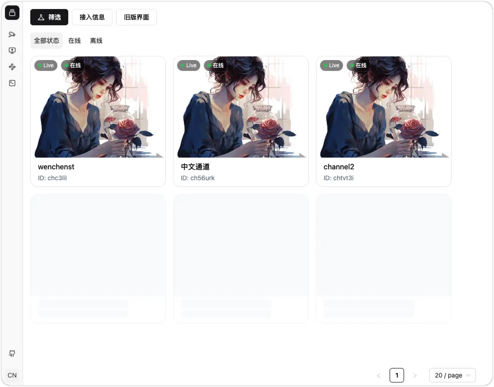
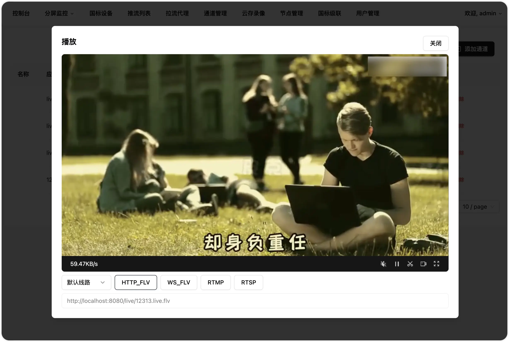

# 开箱即用的 GB/T28181 协议视频平台

Web Video Platform 是一个基于 GB/T28181-2022 标准实现的开箱即用的网络视频平台，负责实现核心信令与设备管理后台部分，支持 NAT 穿透，支持海康、大华、宇视等品牌的 IPC、NVR 接入。支持国标级联。

## 在线演示平台

+ [演示平台线路 1 (推荐)，点击访问](http://gowvp.golang.space:15123/)
+ [演示平台线路 2 (3MB 带宽手下留情)](http://wvp.golang.space/)

## 应用场景：
+ 支持浏览器无插件播放摄像头视频。
+ 支持国标设备(摄像机、平台、NVR等)设备接入
+ 支持非国标(onvif, rtsp, rtmp，直播设备等等)设备接入，充分利旧。
+ 支持国标级联。多平台级联。跨网视频预览。
+ 支持跨网网闸平台互联。

## 快速开始

待 1.0 版本发布才提供安装包，如果你是 Go 语言开发者并熟悉 docker，可以继续~~~

**前置条件**

+ Golang
+ Docker & Docker Compose
+ Make

**操作流程**

+ 1. 克隆本项目
+ 2. 修改 configs/config.toml 中 `WebHookIP` 为你的局域网 IP
+ 3. 执行 `make build/linux && docker compose up -d`
+ 4. 自动创建了 zlm.conf 文件夹，获取 config.ini 的 api 秘钥，填写到 `configs/config.toml` 的 `Secret`
+ 5. 执行 `docker compose restart`
+ 6. 浏览器访问 `http://localhost:15123`

##  如何参与开发?

1. fork 本项目
2. 编辑器 run/debug 设置配置输出目录为项目根目录
3. 修改，提交 PR，说明修改内容

## 文档

GoWVP [[在线接口文档](apifox.com/apidoc/shared-7b67c918-5f72-4f64-b71d-0593d7427b93)](https://apifox.com/apidoc/shared-7b67c918-5f72-4f64-b71d-0593d7427b93)

ZLM使用文档 [github.com/ZLMediaKit/ZLMediaKit](https://github.com/ZLMediaKit/ZLMediaKit)

## 功能特性
- [x] 集成 web 界面
- [x] 兼容性良好
- [x] 接入设备
  - [ ] 视频预览
  - [ ] 支持主码流子码流切换
  - [ ] 无限制接入路数，能接入多少设备只取决于你的服务器性能
  - [ ] 云台控制，控制设备转向，拉近，拉远
  - [ ] 预置位查询，使用与设置
  - [ ] 查询 NVR/IPC 上的录像与播放，支持指定时间播放与下载
  - [ ] 无人观看自动断流，节省流量
  - [ ] 视频设备信息同步
  - [ ] 离在线监控
  - [ ] 支持直接输出RTSP、RTMP、HTTP-FLV、Websocket-FLV、HLS多种协议流地址
  - [ ] 支持通过一个流地址直接观看摄像头，无需登录以及调用任何接口
  - [ ] 支持 UDP 和 TCP 两种国标信令传输模式
  - [ ] 支持 UDP 和 TCP 被动,TCP 主动 三种国标流传输模式
  - [ ] 支持检索,通道筛选
  - [ ] 支持通道子目录查询
  - [ ] 支持过滤音频，防止杂音影响观看
  - [ ] 支持国标网络校时
  - [x] 支持播放 H264 和 H265
  - [ ] 报警信息处理，支持向前端推送报警信息
  - [ ] 语音对讲
  - [ ] 支持业务分组和行政区划树自定义展示以及级联推送
  - [ ] 支持订阅与通知方法
    - [ ] 移动位置订阅
    - [ ] 移动位置通知处理
    - [ ] 报警事件订阅
    - [ ] 报警事件通知处理
    - [ ] 设备目录订阅
    - [ ] 设备目录通知处理
  -  [ ] 移动位置查询和显示
  - [ ] 支持手动添加设备和给设备设置单独的密码
-  [ ] 支持平台对接接入
-  [ ] 支持国标级联
  - [ ] 国标通道向上级联
    - [ ] Wweb 添加上级平台
    - [ ] 注册
    - [ ] 心跳保活
    - [ ] 通道选择
    - [ ] 支持通道编号自定义, 支持每个平台使用不同的通道编号
    - [ ] 通道推送
    - [ ] 点播
    - [ ] 云台控制
    - [ ] 平台状态查询
    - [ ] 平台信息查询
    - [ ] 平台远程启动
    - [ ] 每个级联平台可自定义的虚拟目录
    - [ ] 目录订阅与通知
    - [ ] 录像查看与播放
    - [ ] GPS订阅与通知（直播推流）
    - [ ] 语音对讲
  - [ ] 支持同时级联到多个上级平台
- [ ] 支持自动配置ZLM媒体服务, 减少因配置问题所出现的问题
- [ ] 多流媒体节点，自动选择负载最低的节点使用
- [ ] 支持启用udp多端口模式, 提高udp模式下媒体传输性能
- [x] 支持局域网/互联网/特殊网络环境部署
- [x] 支持 gowvp 与 zlm 分开部署，提升平台并发能力
- [ ] 支持拉流RTSP/RTMP，分发为各种流格式，或者推送到其他国标平台
- [ ] 支持推流RTSP/RTMP，分发为各种流格式，或者推送到其他国标平台
- [ ] 支持推流鉴权
- [x] 支持接口鉴权
- [ ] 云端录像，推流/代理/国标视频均可以录制在云端服务器，支持预览和下载
- [ ] 支持跨域请求，支持前后端分离部署
- [x] 支持 PostgreSQL 数据库
- [ ] 支持录制计划, 根据设定的时间对通道进行录制. 暂不支持将录制的内容转发到国标上级

## 授权协议
本项目自有代码使用宽松的MIT协议，在保留版权信息的情况下可以自由应用于各自商用、非商业的项目。

但是本项目也零碎的使用了一些其他的开源代码，在商用的情况下请自行替代或剔除； 由于使用本项目而产生的商业纠纷或侵权行为一概与本项目及开发者无关，请自行承担法律风险。

在使用本项目代码时，也应该在授权协议中同时表明本项目依赖的第三方库的协议

## GoWVP, GB/T28181 交流群

 

## QA

> 怎么没有前端资源? 如何加载网页呢?

前端资源打包后放到项目根目录，重命名为 `www` 即可正常加载。

> 有没有代码相关的学习资料?

[GB/T28181 全栈开发日记[1]：从 0 到实现 GB28181 协议的完整实践](https://juejin.cn/post/7456722441395568651)

[GB/T28181 全栈开发日记[2]：搭建服务端，解决跨域，接口联调](https://juejin.cn/post/7456796962120417314)

[GB/T28181 全栈开发日记[3]：使用 React 组件构建监控数据面板](https://juejin.cn/post/7457228085826764834)

[GB/T28181 全栈开发日记[4]：使用 ESlint 辅助开发](https://juejin.cn/post/7461539078111789108)

[GB/T28181 全栈开发日记[5]：使用 react-hook-form 完成表单](https://juejin.cn/post/7461899974198181922)

[GB/T28181 全栈开发日记[6]：React 快速接入 jessibuca.js 播放器](https://juejin.cn/post/7462229773982351410)

开发中...

> 有没有使用资料?

[RTMP 推拉流规则](https://juejin.cn/post/7463046634558718004)

码字中...

## 开源库
Java WVP @648540858 [wvp-GB28181-pro](https://github.com/648540858/wvp-GB28181-pro)

SIP 服务 @panjjo [gosip](https://github.com/panjjo/gosip)

流媒体服务基于@夏楚 [ZLMediaKit](https://github.com/ZLMediaKit/ZLMediaKit)

播放器使用@dexter [jessibuca](https://github.com/langhuihui/jessibuca/tree/v3)

项目框架基于 @ixugo [goweb](https://github.com/ixugo/goweb)